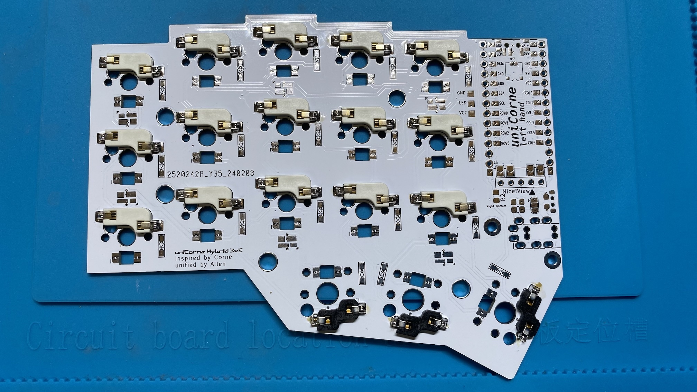

## Materials Needed: 
- Common parts 
  | **Component**        | **Quantity** | **Description**                                      |
  |---                   |---           | ---                                                  |
  | PCB                  | 2            | Left and right side                                  |
  | Switches             | 36           | Mechanical switches (e.g., Cherry MX, Kailh Choc)    |
  | Keycaps              | 36           | Keycaps compatible with your switches                |
  | Hotswap Sockets      | 36           | Hotswap sockets compatible with your switches        |
  | Diodes               | 36           | Diodes for each switch e.g. 1N4148W SOD-123          |
  | TRRS Sockets         | 2            | For connecting the two halves of keyboard            |
  | TRRS Cable           | 1            | Cable to connect the two halves of keyboard          |
  | Top Plate            | 1            | Case compatible with uniCorne-3x5 PCB                |
  | Bottom Plate         | 1            | Plate compatible with uniCorne-3x5 layout            |
  | Screws               | As needed    | Screws for assembling the case                       |
  | USB Cable            | 1            | USB cable for connecting the keyboard                |
- Optional parts 
  | **Component**        | **Quantity** | **Description**                                  |
  |---                   |---           | ---                                              |
  | LED                  | 30           | For per-key, SK6812 mini-e                       |
  | LED                  | 6            | For backlight, SK6812 mini 3535                  |
  | OLED Screen          | 1            | For displaying information, 128x32               |
  | Handedness resistors | 2            | One for each side                                |
  | Tenting Kit          | 1            | For ergonomic typing angle                       |

## Step-by-Step Guide:
1. Before starting: 
   uniCorne is designed to be soldered only on the bottom side.
1. Align PCBs: 
    
   Theres is a marking on top side indicating the correct side. 
   
1. Hotswaps: 
   Place the hot-swappable sockets on the PCB, and make sure it align with the holes on the PCB. Then, solder it. 
   
1. Diodes: 
   Diodes have markings to indicate the direction.  Make sure they are aligned with slikscreen. 
   
1. MCU
   1. Solder jumpers for MCU on the bottom side. 
      
   1. Solder pin sockets which allows you to replace MCUs later. 
      
   1. Place the MUC on pic sockets and insert pin headers. 
      
   1. Cut the pin header for one side once everything is aligned. 
      
   1. Solder one side and repeat for the other side. The result should look like this when done. 
      
1. TRRS Socket: 
   Solder TRRS socket. 
   
1. Test the PCB: 
   Before fully assembling, test the PCB to ensure all switches work correctly after installing the relavant [firmware](https://github.com/Thunderbird2086/tb2086-qmk/releases). You can use a keyboard tester software for this e.g. QMK Toolbox.
1. Optional parts:
   - LEDs: 
     Solder LEDs.  There are two types: one for per-key lighting and the other for backlighting. 
     
   - OLED Screen: 
     If you have an OLED screen, solder jumpers for OLED as well as 5-pin socket on the bottom side. 
     
   - Hardware Handedness: 
     If you want to use hardware handedness, solder the handedness resitor on the bottom side. 
     
1. Assemble: 
   Place top plate, the PCB, and the bottom plate. Then, secure them with screws.
1. Add Keycaps: 
   Place your keycaps onto the switches. Ensure they are firmly seated.
1. Install Tenting Kit (optional): 
   If you have a tenting kit, attach it to the bottom of the case for an ergonomic typing angle.
1. Final Check: 
   Double-check all connections and ensure everything is securely in place. 
   Test the keyboard again to ensure all keys are functioning properly.
1. Enjoy Your New Keyboard: 
   Customize your keymap and enjoy typing on your new uniCorne-3x5 keyboard!
